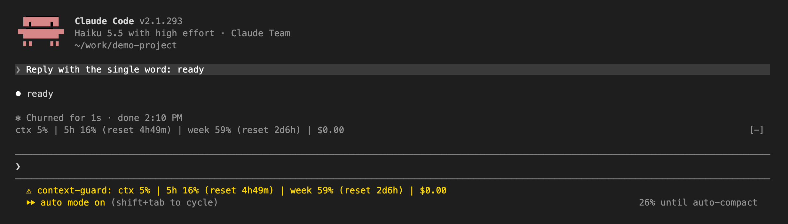
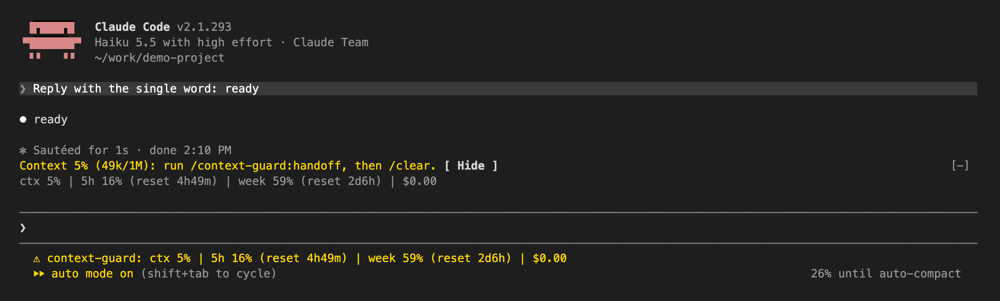
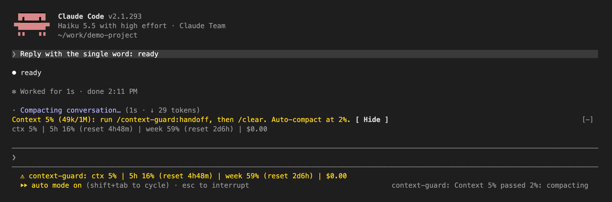
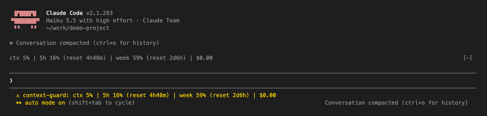
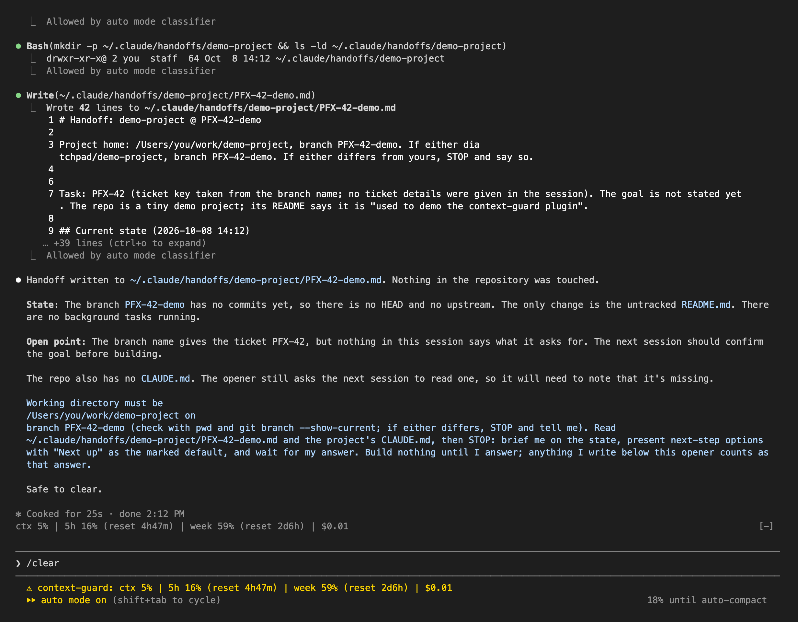
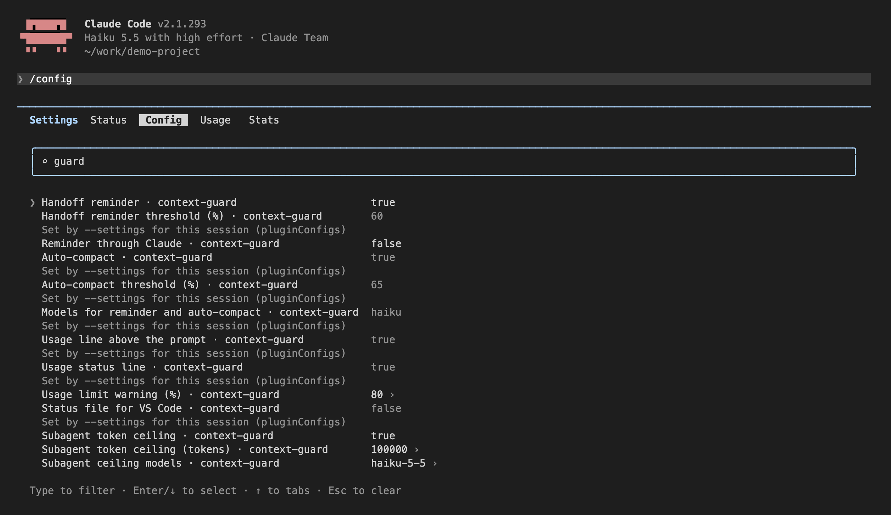

# Strzelichowski Solutions: Claude Code plugins

Marketplace `strzelichowski-solutions` with one plugin, `context-guard`, plus an optional VS Code extension that shows its status. Requires Claude Code 2.1.292 or later (`claude --version`).

## Install

In Claude Code (terminal or VS Code panel):

```
/plugin marketplace add Fantomkiller/strzelichowski-solutions-claude-plugins
/plugin install context-guard@strzelichowski-solutions
```

Or from a shell, with options set at install time:

```
claude plugin marketplace add Fantomkiller/strzelichowski-solutions-claude-plugins
claude plugin install context-guard@strzelichowski-solutions --config reminder_percent=60 --config compact_percent=65
```

In VS Code you can also open this link, which goes straight to the plugin's install dialog:
`vscode://anthropic.claude-code/install-plugin?plugin=context-guard&marketplace=Fantomkiller/strzelichowski-solutions-claude-plugins`

From a local copy (unzipped or cloned), pass its path to `marketplace add` instead. Start a new session afterwards.

Optionally, VS Code users can also install the status bar extension, which shows the same figures on VS Code's own status bar (hover for bars and reset times, click for a menu with a usage panel):

```
gh release download --repo Fantomkiller/strzelichowski-solutions-claude-plugins --pattern '*.vsix'   # or take it from vscode-context-guard/ in a clone
code --install-extension context-guard-status.vsix
```

## What it does

| Feature | Where you see it |
| --- | --- |
| Context fill, 5-hour and weekly usage limits with time to reset, session cost | terminal: a line above the prompt and on the status line; VS Code panel (which draws no plugin elements above its prompt): a line beneath each of Claude's answers |
| Handoff reminder once the main conversation passes **60%** of the model's context | terminal: yellow line above the prompt with a **Hide** button, plus a notification; VS Code panel: a line beneath each answer |
| `/context-guard:handoff`: writes `~/.claude/handoffs/<repo>/<branch>.md` and prints an opener for a fresh session; never commits, pushes, stages or stashes | in the conversation |
| Auto-compact of the main conversation at **65%**; a conversation that stays above the threshold after compacting is compacted again only after it grows 5 more points | notification, then Claude Code's own "Conversation compacted" |
| Warning when a 5-hour or weekly limit passes **80%** | notice added to the conversation |
| Token ceiling for subagents (default Claude Haiku 5.5, **100k**): an oversized tool result is cut so the next request stays under the ceiling; the subagent keeps working | in the subagent's tool result |

Usage limits appear on a Claude subscription only; with an API key the line shows context and cost. Figures refresh after each turn.

## What it looks like

Captured from a real terminal session (Claude Code 2.1.293, Claude Haiku 5.5, thresholds lowered so they trip on a short conversation). In the Claude Code panel in VS Code, which does not draw plugin elements around its prompt box, the same figures and the reminder appear beneath each of Claude's answers (option "Line beneath each answer").

**Usage line** above the prompt (and, in the terminal, on the status line):



**Handoff reminder** once the context passes the threshold:



**Auto-compact** past its threshold, then Claude Code's own compaction:





**`/context-guard:handoff`** writes the handoff file ([example](docs/examples/handoff-PFX-42-demo.md)) and prints the opener for a fresh session:



## Settings

Every option can be changed interactively:

- **`/config`**, then type `guard` to filter: each option is a row; Enter toggles a switch or edits a value.
- **`/plugin configure context-guard@strzelichowski-solutions`**: a form with all options.
- **VS Code**: `/plugins`, then the gear icon on the plugin's row.
- **`~/.claude/settings.json`**: `"pluginConfigs": { "context-guard@strzelichowski-solutions": { "options": { "reminder_percent": 50 } } }`.



| Option | Default | Meaning |
| --- | --- | --- |
| Handoff reminder | on | yellow line above the prompt and a notification |
| Handoff reminder threshold (%) | 60 | when the reminder shows |
| Reminder through Claude | off | also ask Claude to mention the reminder at the start of its next reply |
| Auto-compact | on | compact the main conversation |
| Auto-compact threshold (%) | 65 | when it compacts |
| Models for reminder and auto-compact | `opus` | comma-separated model id fragments; empty = every model |
| Usage line above the prompt | on | context, limits and cost above the prompt (terminal) |
| Line beneath each answer | auto | usage line and reminder beneath Claude's answers; auto = only where no band is drawn (VS Code panel), always, off |
| Usage status line | on | the same line on the status line under the prompt (terminal only) |
| Usage limit warning (%) | 80 | warning when a limit reaches it; 0 = off |
| Status file for VS Code | on | writes `~/.claude/context-guard/sessions/*.json` for the VS Code extension |
| Subagent token ceiling | on | the subagent guard |
| Subagent token ceiling (tokens) | 100000 | the ceiling |
| Subagent ceiling models | `haiku-5-5` | comma-separated model id fragments; empty = every model |

## Subagent compaction

The plugin cannot compact a subagent; Claude Code does that by itself. To make a Claude Haiku 5.5 subagent compact at ~95k (just below its 5x price step at 100k) and keep working, add to `~/.claude/settings.json`:

```json
{
  "modelSettings": { "claude-haiku-5-5": { "autoCompactWindow": 100000, "effortLevel": "high" } },
  "env": { "CLAUDE_AUTOCOMPACT_PCT_OVERRIDE": "95" }
}
```

`autoCompactWindow` takes 100000 at least; keep the plugin's subagent ceiling at or above the point where compaction runs. `CLAUDE_AUTOCOMPACT_PCT_OVERRIDE` applies to every model, so it also brings other models' automatic compaction a little earlier.

## Development

- Plugin checks: `claude plugin validate plugins/context-guard` and `claude plugin test plugins/context-guard`.
- Try a change without installing: `claude --plugin-dir plugins/context-guard`.
- VS Code extension: plain JavaScript, no dependencies. Rebuild the `.vsix` with `npx @vscode/vsce package --allow-missing-repository --skip-license -o context-guard-status.vsix` in `vscode-context-guard/`.
